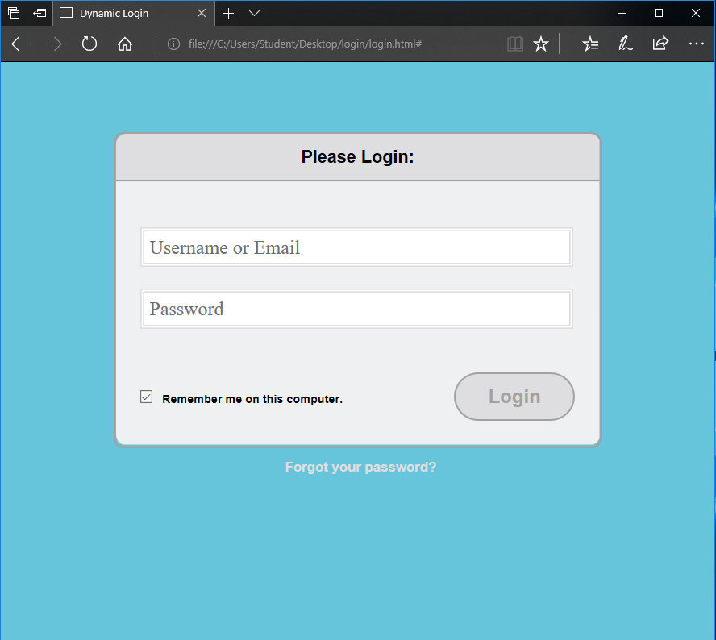
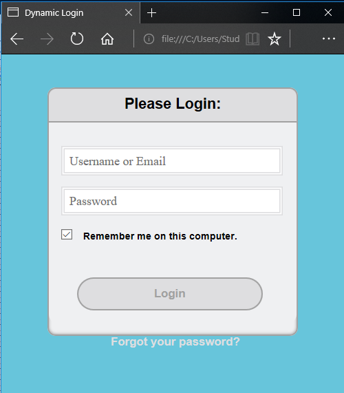

# Dynamic Login Page (HTML and CSS)
## Objective 
Demonstrate using two different types of media breaks in the CSS code on a basic login page to make the interface display differently on mobile screens.

## Steps Taken
This project started with framework HTML and CSS code. I de-bugged the code until the dummy login page looked the way I intended, then created a second CSS file to complete the objective for the project. In the second CSS file, most of the styling remains the same except for the portions setting fixed size for elements on the page. These elements are divided over two media break sessions, one with display preferences on screens over 500px and one for screens less than 500px.

## Results
There were two areas where I had to sort out bugs on the page. The first was in the HTML to get the form elements placeholder text to display. I started by looking at the output and comparing my HTML to see which section was likely the culprit. I found a typing error and once it was fixed my text appeared as attended. The second issue I had was with the login button. When I changed from my dynamic CSS to the new CSS with the media breaks, the text in the button changed sizes when I hadn't intended it to. I started with the new CSS but after a few reads through I did not see any errors. I then returned to the original CSS and realized the framework CSS was missing a unit on the font size. I compared adding in a unit and I liked it much better, so I made the change to the original CSS.

The final product looks like I wanted and the style change on smaller screens makes it much more usable. Here are some screenshots:

### Screens > 500px

### Screens < 499px

